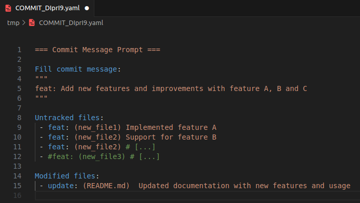
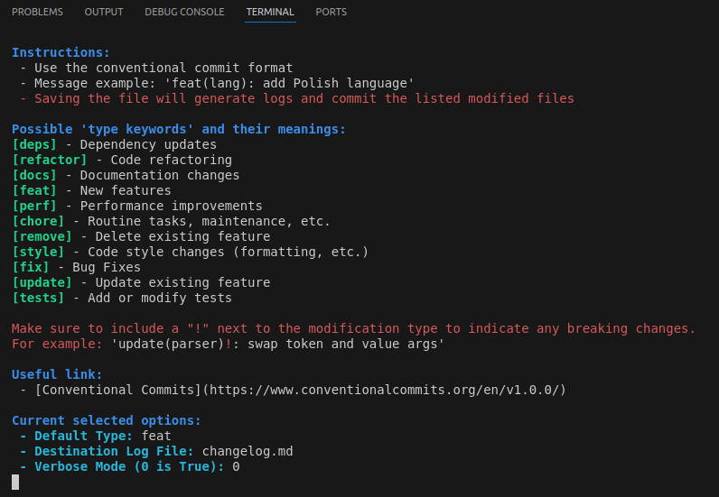

# Changelog Management Scripts

This repository contains two bash scripts designed to help manage changelogs in a Git repository: `create_log_commit.sh` and `create_log_tag.sh`. These scripts work together to create a streamlined process for maintaining changelogs across different branches and merging them when creating new tags.

## Scripts Overview

### 1. create_log_commit.sh

This script is used to create log entries for individual commits. It's designed to be run before each commit or as a pre-commit hook.

Key features:
- Creates branch-specific metalog files in the `.logs` directory
- Supports conventional commit message format
- Allows for detailed descriptions of changes
- Can be run in interactive mode inside VSCode

### 2. create_log_tag.sh

This script is used to compile all metalog entries into a final changelog when creating a new tag. It's designed to be run when merging into the main branch or as a post-merge hook.

Key features:
- Processes all `.metalogs` files in the `.logs` directory
- Compiles entries into a single changelog file (default: `changelog.md`)
- Cleans up processed metalog files after updating the changelog

## Installation

1. Clone this repository or download the scripts.
2. Make the scripts executable:
```sh
chmod +x create_log_commit.sh create_log_tag.sh
```
3. Place the scripts in your project's root directory / in a location within your PATH or create an alias linked to these scripts.

## Usage

### create_log_commit.sh

Run this script before making a commit:

```sh
./create_log_commit.sh [OPTIONS] <type> [<destination_file>]
```

Options:
- `--help`: Display help message
- `-v`: Enable verbose mode

Arguments:
- `type`: The type of change (e.g., 'feat', 'fix', 'update', etc.)
- `destination_file`: (Optional) The changelog file to update (default: changelog.md)

<br>

A new window opens on a temporary file and presents the content of a `git status`.
Now, you just need to:
- Write the commit message between the `"""` `"""`.
- Write the description of changes for the logs of each modified file.
    - Each comment starting with a `#` is ignored by the logs.
    - Each line starting with a `#` (or deleted) is ignored by the logs and by git.
- Save the file (it will automatically delete)

<br>

**Example:**


**Given instructions inside stdout:**

### create_log_tag.sh

Run this script when you want to create a new tag and update the main changelog:
```sh
./create_log_tag.sh [OPTIONS] <tag> [<destination_file>]
```
Options:
- `--help`: Display help message
- `-v`: Enable verbose mode

Arguments:
- `tag`: The new tag version (e.g., '1.2.3')
- `destination_file`: (Optional) The changelog file to update (default: changelog.md)

## Best Practices

1. Run `create_log_commit.sh` to replace git commit to ensure all changes are logged.
2. Use descriptive commit messages following the conventional commit format.
3. Run `create_log_tag.sh` when creating a new release or merging into the main branch.
4. Regularly review and clean up the `.logs` directory if needed.

## Incoming Updates

- Interactive Mode
- Integration with CI/CD
- Git Hook Integration
- Customizable Categories / Changelog Formatting Options
## Contributing

Contributions are welcome! Please feel free to submit a Pull Request.

## License

This project is licensed under the MIT License - see the LICENSE file for details.